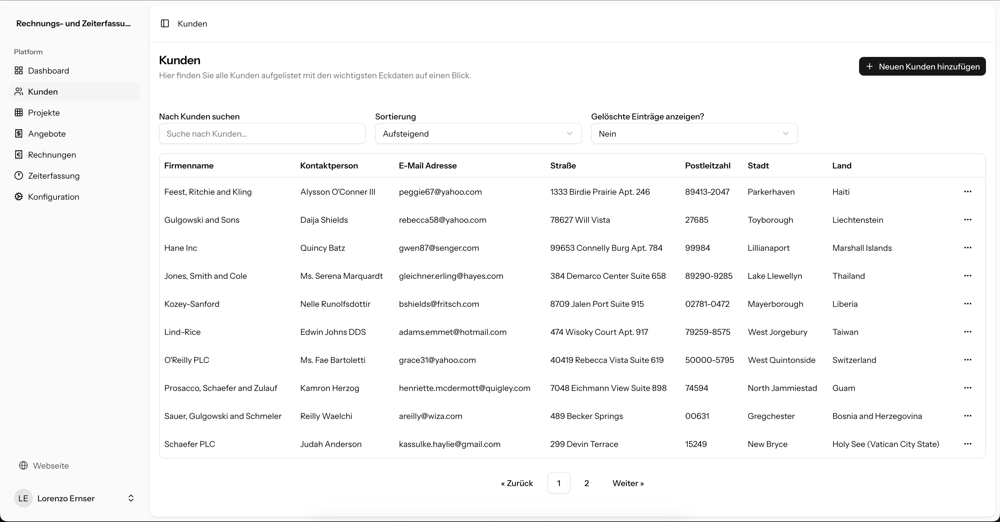
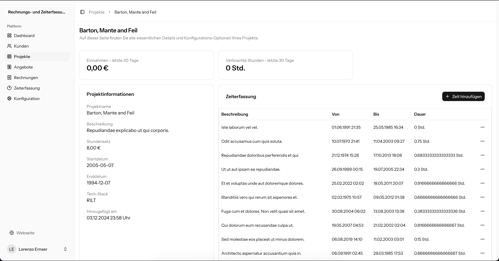
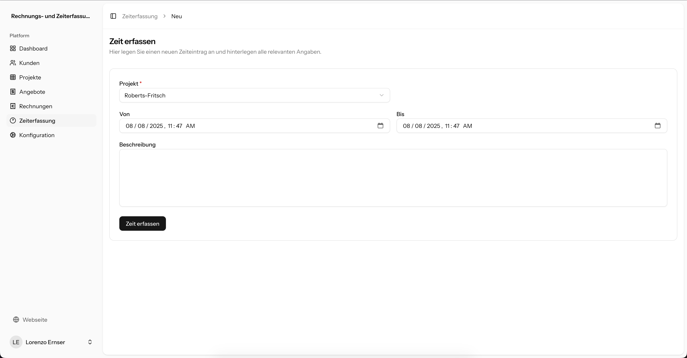
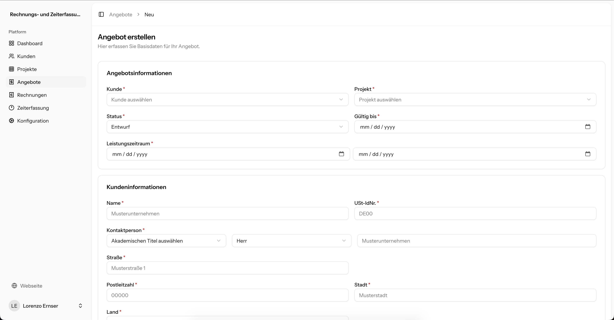
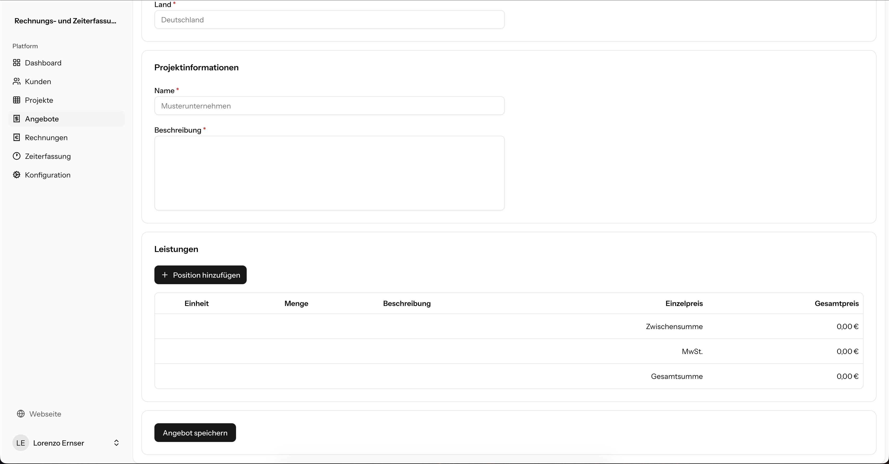
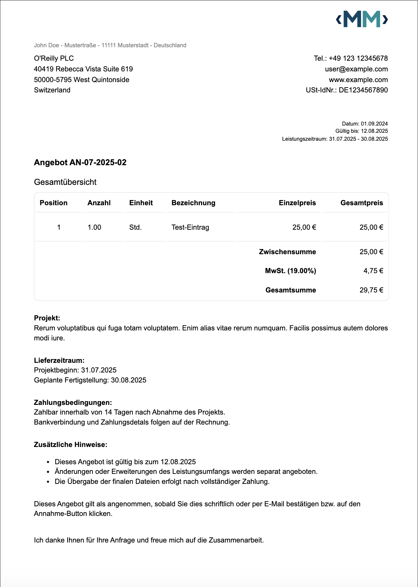

# 💼 Rechnungs- und Zeiterfassungs-Tool

Ein webbasiertes Tool zur Verwaltung von Kunden, Projekten, Angeboten und Rechnungen – mit integrierter Zeiterfassung.  
Zielgruppe sind Einzelunternehmer, die ohne externe Tools ihren Arbeitsalltag organisieren wollen.

---

## 🔍 Features

- ✅ Kundenerstellung mit Projektverknüpfung
- ✅ Projektbasierte Zeiterfassung pro Benutzer
- ✅ Angebotserstellung und Rechnungsgenerierung als PDF
- ✅ Automatischer E-Mail-Versand über Laravel Horizon
- ✅ Unternehmensdaten pro Account einstellbar
- ✅ UI mit React.js, TailwindCSS und Inertia.js
- ✅ PDF-Erstellung über Browsershot
- ✅ Tests mit Laravel Test Suite (teils vorhanden, wird ausgebaut)

---

## 🛠️ Tech-Stack

| Bereich           | Technologien                                                |
|-------------------|-------------------------------------------------------------|
| Backend           | Laravel 11, PHP 8.3, Horizon                                |
| Frontend          | React.js, TailwindCSS, Inertia.js                           |
| PDF-Generierung   | [spatie/browsershot](https://github.com/spatie/browsershot) |
| Auth              | Built-In                                                    |
| Mailversand       | Queued mit Laravel Jobs                                     |
| Deployment        | deployer                                                    |

---

## Installation

### 1. Repository klonen

Klone das Repository in einen Ordner deiner Wahl.

```shell
git clone git@github.com:marcomiddeldorff/invoice-time-tracker.git
```

### 2. Composer & NPM Abhängigkeiten installieren

Installiere zunächst die Composer & NPM Abhängigkeiten

```shell
composer install # oder: composer install --no-dev --optimize-autoloader
```

```
npm install
```

### 3. NPM-Build ausführen

Führe nun den NPM Build Befehl aus, damit alle Frontend-Assets gebuildet werden. 

```shell
npm run build
```

### 4. `.env.example` kopieren

Kopiere dir die `.env.example` in den gleichen Ordner und bennene die Datei um zu: `.env`. Passe ggfs. die Konfiguration nach deinen Wünschen an.

```shell
cp .env.example .env
```

### 5. Datenbank & Tabellen erstellen

Du kannst **SQLite** verwenden, wenn du dir das Erstellen von einer separaten Datenbank sparen möchtest. SQLite ist standardmäßig in der .env hinterlegt. Du musst hier somit keine weiteren Änderungen an der `.env` durchführen.

```shell
php artisan migrate
```

### 6. Benutzer erstellen

Nun kannst du deinen Benutzer erstellen. Dafür wurde ein eigenständiger Befehl implementiert, welcher dir die Arbeit abnimmt. 

```shell
php artisan make:user
```

Dir werden insgesamt drei Fragen gestellt. Du gibst deinen Namen, deine E-Mail Adresse und dein gewünschtes Passwort an. Der Befehl kümmert sich dann um die Erstellung deines Accounts und gibt dir eine entsprechende Rückmeldung, ob die Erstellung erfolgreich war, oder fehlgeschlagen ist. 

### 7. Applikation starten

Starte nun die Applikation mit dem Laravel-Built-In Befehl. Die Applikation sollte dann unter `http://127.0.0.1:8000` erreichbar sein. 

```shell
php artisan serve
```

---

## 🧱 Architektur & Ablauf

1. Benutzer erstellt einen Kunden
2. Er legt ein oder mehrere Projekte an und weist sie dem Kunden zu
3. Während der Projektlaufzeit erfasst der Benutzer seine Arbeitszeit
4. Auf Basis dieser Daten können Angebote oder Rechnungen erstellt werden
5. Der Benutzer versendet PDFs direkt aus der App per Mail

---

## 🖼️ Screenshots

<details>
<summary>🖼️ Screenshots der Applikation (klicken zum Öffnen)</summary>

### Kunden-Übersicht


### Projekt-Detailansicht


### Zeiterfassung



### Angebotserstellung



### Angebots-PDF


</details>

---

## 📚 Projektstatus

Dieses Tool ist für den internen Gebrauch konzipiert, wird jedoch als öffentliches Repository geführt, um meine Arbeitsweise im Bereich Businesslogik, Laravel-Architektur und UI-Umsetzung zu demonstrieren.

Eine kommerzielle Nutzung ist nicht vorgesehen – aber die Konzepte können als Inspiration dienen.

---

## 🧠 Lessons Learned
- Modellierung realistischer Geschäftsprozesse in Laravel
- PDF-Generierung mit Spatie Browsershot und Caching
- E-Mail-Queueing mit Laravel Horizon
- Inertia-Integration mit React & Tailwind
- Trennung von Controller, FormRequest und Services
- Umgang mit testbaren Architekturen (Teilabdeckung vorhanden)


## 📬 Kontakt

📫 [marco@marco-middeldorff.de](mailto:marco@marco-middeldorff.de)  
🔗 [LinkedIn (Marco Middeldorff)](https://www.linkedin.com/in/marco-middeldorff-527570276/)  
🔗 [Xing (Marco Middeldorff)](https://www.xing.com/profile/Marco_Middeldorff/web_profiles)
